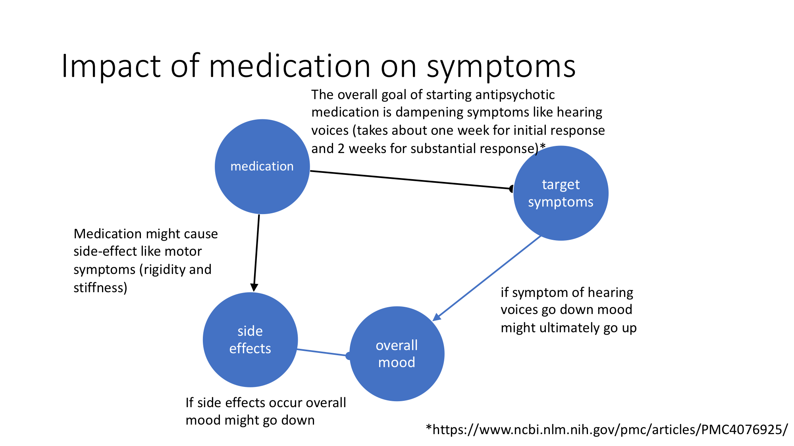

```{r setup, include=FALSE}
knitr::opts_chunk$set(echo = TRUE)
```

## Possible paths on how medication symptoms and side-effects are related
We here show a simplistic path model on how symptoms and side-effects could be related.
{width=65%}


Due to this complex interactions, long intervals (2-6 weeks) between outpatient visits, and side-effects that occur at shorter time periods (within hours and after a few days) it is hard to disentangle cause and consequences of symptoms and side-effects when starting medication.  

```{r readindata, echo=FALSE, include=FALSE}

time.points <- seq.Date(as.Date("2021-01-01"), by = 1, length.out = 366)

library(readr)
data <- read_csv("dummydata.csv", col_types = cols(X1 = col_skip()))
library(zoo)
data<-zoo(cbind(symptom1=data$V1, symptom2=data$V2), time.points)

```


## Electronic momentary assesment allows symptom monitoring and evaluation
Day by day smartphone based symptom assesment and a visualisation of the course for the symptoms might allow a better evaluation of sympotms at a follow-up appointment. 

## Impact for EMA data
We here want to test the impact package for use in an n of 1 experiment with electronic momentary assesment. We here created a dummy time series data set. It includes two symptoms that were tracked every day on a scale from 0 to 3:

```{r display data, echo=FALSE, include=TRUE}

head(data)
```

## Plots

Time series plot of dummy data of two electronic momentary assessment scales of hypothetical symptoms with vertical line at date of medication start (time point of impact, 2021-05-02) :

```{r plot, echo=FALSE,warning=FALSE}
library(ggplot2)
autoplot(data, label=T, facets = NULL )+
  geom_vline(xintercept = as.numeric(as.Date("2021-05-02")), 
             color = "black", 
             linetype=4)+theme_classic() 
```


```{r resultsplot, echo=FALSE,warning=FALSE, include=FALSE}
#define pre and post period
pre.period <- as.Date(c("2021-01-01", "2021-05-01"))
post.period <- as.Date(c("2021-05-02", "2021-05-15"))
library(CausalImpact)
#estimate causal impact
impact <- CausalImpact(data,  pre.period, post.period)

```

For a statistical evaluation of the medication effect we looked at the period from medication start to two weeks therafter. With the impact package we are able to infer a quantitative estimate of the counterfactual via a synthetic control and thus estimate the causal effect.
Impact plot of impact estimate at medication intake according to K. Brodersen Annals of Applied Statistics 2015 https://arxiv.org/abs/1506.00356 for documentation http://google.github.io/CausalImpact/CausalImpact.html:

```{r impactplot, echo=FALSE,warning=FALSE}
plot(impact)

```


And here the narrative summary of the impact estimation: 
```{r resultssummary, echo=FALSE, include=TRUE}
summary(impact)
summary(impact, "report")
```

